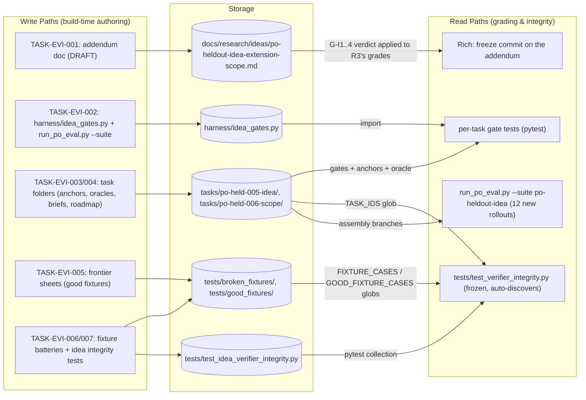
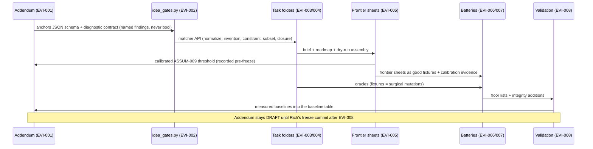
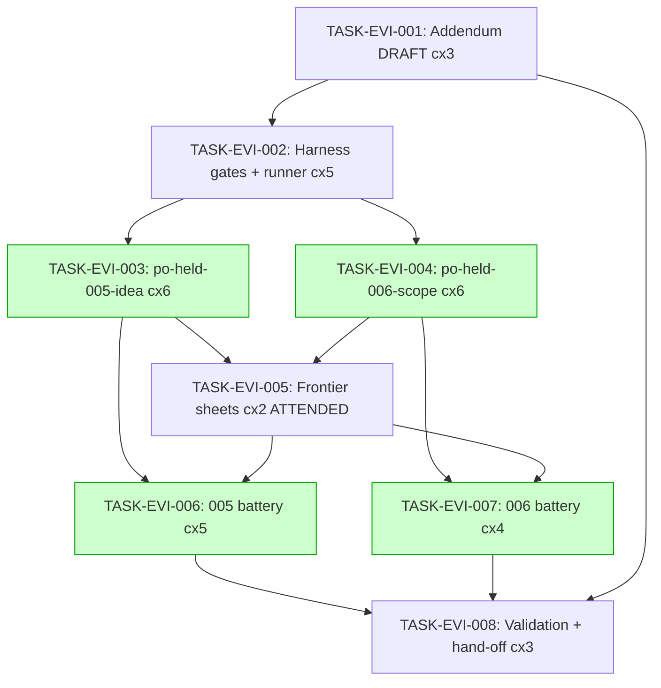

# Implementation Guide — FEAT-EVAL-IDEA (Idea-Mode Held-Out Eval Tasks)

**Parent review:** TASK-REV-09AB (`.claude/reviews/TASK-REV-09AB-review-report.md`)
**Spec:** `features/idea-mode-held-out-evals/` (38 scenarios, 11 human-resolved assumptions)
**Execution mode:** sequential hand-build in-session (Context B, 2026-07-05); waves = commit
checkpoints, every commit leaves `pytest tests/` green.
**Wave 0 pre-flight:** `python3 harness/link_assets.py && python3 -m pytest tests/ -q` —
capture the pre-extension 33-green as the non-regression baseline for TASK-EVI-008.

## Standing invariants (every task, every commit)

- `docs/research/ideas/po-heldout-suite-scope.md`, `harness/po_contract.py`,
  `harness/grading.py`, `tests/test_verifier_integrity.py`, `harness/link_assets.py`,
  `harness/ASSETS.sha256`, `tasks/po-held-001..004/**`, existing fixtures: **byte-identical**.
- Never create `input/corpus/` in a new task (frozen 13-file assertion); never name an
  anchor file `coverage_checklist.json` (frozen area pin).
- New gates consume the parsed payload dict, never raw response text.
- New assets are fresh-authored, in-repo, zero client content.

## Data Flow: Read/Write Paths

Every write path has a live reader — no disconnection alert. The frozen integrity suite
(R2) reads the new tasks *automatically* via its globs, which is why fixtures must land
atomically with task folders.

## Integration Contracts (sequence)

## Task Dependencies

_Green tasks are parallel-safe within their wave (003∥004; 006∥007). Execution is
sequential hand-build per Context B — waves act as commit checkpoints._

Waves: 1:[EVI-001] → 2:[EVI-002] → 3:[EVI-003, EVI-004] → 4:[EVI-005] → 5:[EVI-006, EVI-007] → 6:[EVI-008]

## §4: Integration Contracts

### Contract: ANCHOR_SCHEMA_AND_DIAGNOSTIC_CONTRACT
- **Producer task:** TASK-EVI-001 (addendum §instrument-contracts)
- **Consumer task(s):** TASK-EVI-002, TASK-EVI-003, TASK-EVI-004
- **Artifact type:** documented JSON schema + function return-shape contract
- **Format constraint:** anchors JSON = `{groups: [{id, alternates: [regex,...]}]}`;
  matcher returns structured findings naming the unlicensed detail / offending feature id
  (never a bare bool) — two feature scenarios assert the naming
- **Validation method:** TASK-EVI-002's seam test + unit tests

### Contract: IDEA_GATES_API
- **Producer task:** TASK-EVI-002
- **Consumer task(s):** TASK-EVI-003, TASK-EVI-004, TASK-EVI-006, TASK-EVI-007
- **Artifact type:** Python module (`harness/idea_gates.py`, stdlib-only)
- **Format constraint:** pure functions over the parsed payload dict; closure computed
  against the REFERENCE graph; central NFKC normalization; per-group licensing
- **Validation method:** consumer seam tests (EVI-003/004) + gate tests importing the module

### Contract: CALIBRATED_THRESHOLD
- **Producer task:** TASK-EVI-005
- **Consumer task(s):** TASK-EVI-006, TASK-EVI-007, TASK-EVI-001 (record), TASK-EVI-008 (baseline)
- **Artifact type:** addendum calibration-section entry + frontier good fixtures
- **Format constraint:** ASSUM-009 threshold decision (>2 or >3) with evidence, recorded
  BEFORE evasion/stuffing fixtures are cut and before the freeze
- **Validation method:** TASK-EVI-008's baseline check; fixtures must pass/fail per the
  recorded threshold
