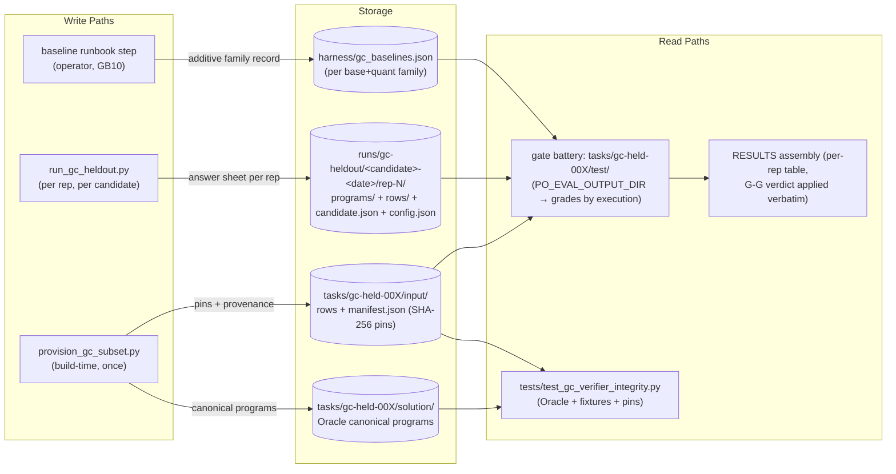
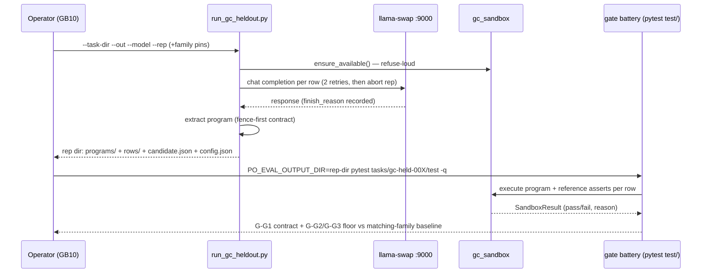
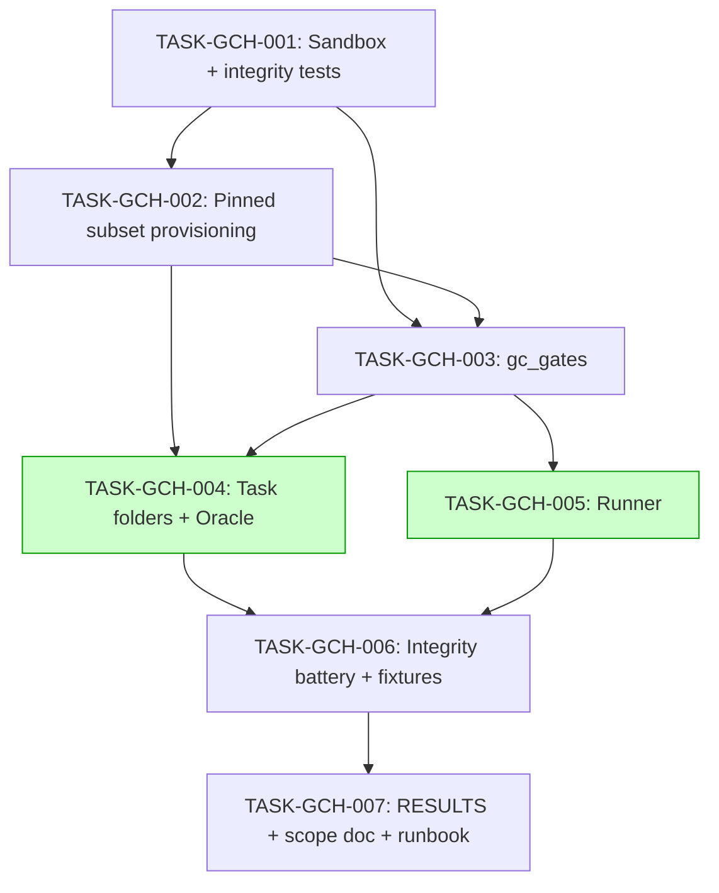

# Implementation Guide — gc-heldout (FEAT-EVAL-GC / OBS-7)

Consumer: this build session (waves executed in order) and the post-merge reviewer.
Spec of record: `features/gc-heldout-suite/` @ 63ec53f. Decisions: `.claude/reviews/TASK-REV-B7E2-review-report.md`.

## Data Flow: Read/Write Paths

*Look for: every store has a reader; the baseline store (S3) is written only by the operator
runbook (additive) and read by the gate's family rule. No disconnected paths.*

## Integration Contracts (sequence)

*Look for: the runner never grades; grades come only from the gate battery executing in the
sandbox. Nothing is fetched and discarded.*

## Task Dependencies

_Tasks with green background share wave 4 (no file conflicts); build runs them sequentially anyway._

## §4: Integration Contracts

### Contract: SANDBOX_RESULT_AND_AVAILABILITY
- **Producer task:** TASK-GCH-001
- **Consumer task(s):** TASK-GCH-002 (selection-rule validation), TASK-GCH-003 (grading), TASK-GCH-004 (gate tests), TASK-GCH-005 (pre-run probe)
- **Artifact type:** Python module `harness/gc_sandbox.py`
- **Format constraint:** `run_program(text, *, timeout_s, ...) -> SandboxResult(status∈{"pass","fail"}, reason, exit_code, stdout, stderr, seconds)`; `ensure_available()` raises `SandboxUnavailable` naming the missing isolation. Grader bugs raise; candidate failures return `status="fail"` — never conflated.
- **Validation method:** `tests/test_gc_sandbox_integrity.py` green; gate conftest imports both names.

### Contract: PINNED_ROW_SCHEMA_AND_MANIFEST
- **Producer task:** TASK-GCH-002
- **Consumer task(s):** TASK-GCH-003, TASK-GCH-004, TASK-GCH-005
- **Artifact type:** committed JSON (`input/rows/{ROW-ID}/row.json`, `input/manifest.json`)
- **Format constraint:** row.json canonical bytes = `json.dumps(row, indent=2, sort_keys=True) + "\n"`; manifest pins `{row_id, benchmark_task_id, sha256}` per row + selection rule + exclusions + licence/provenance; row ids unique across the whole suite (`HumanEval-N` / `mbpp-N`).
- **Validation method:** `gc_gates.verify_pins(task_dir)` returns no findings; integrity battery cross-task uniqueness test.

### Contract: ANSWER_SHEET_FORMAT
- **Producer task:** TASK-GCH-005 (runner) — Oracle variant produced by TASK-GCH-004
- **Consumer task(s):** TASK-GCH-004 (gate tests), TASK-GCH-006 (fixtures are answer sheets)
- **Artifact type:** directory (`PO_EVAL_OUTPUT_DIR`)
- **Format constraint:** `candidate.json` {model_id, lineage, base_family, quant, oracle:bool}; `programs/{ROW-ID}.py`; optional `rows/{ROW-ID}.json` {finish_reason, extraction} diagnostics. Family key = `"{base_family}/{quant}"` must exist in `harness/gc_baselines.json` unless oracle.
- **Validation method:** gate `test_answer_sheet_contract`; broken fixtures `missing-candidate-record`, `unknown-baseline-family` fail exactly their owning tests.

## Wave discipline

After every wave: `python3 -m pytest tests/ -q` green AND the failing set == baseline
(229 passed, captured pre-change). Frozen files byte-identical throughout (`git status` on
frozen paths clean). The smoke gate in the feature YAML makes this mechanical.
