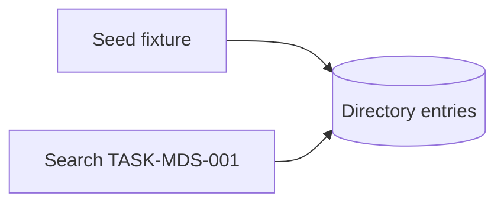

# Implementation Guide — Member Directory Search (FEAT-MDS-01)

## Data Flow: Read/Write Paths

```mermaid
flowchart LR
    SEED[Seed fixture] --> MODEL[(Directory entries)]
    SEARCH[Search TASK-MDS-001] --> MODEL
```

One implementation task carries model, service, access control and page.
