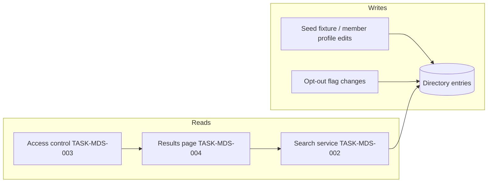
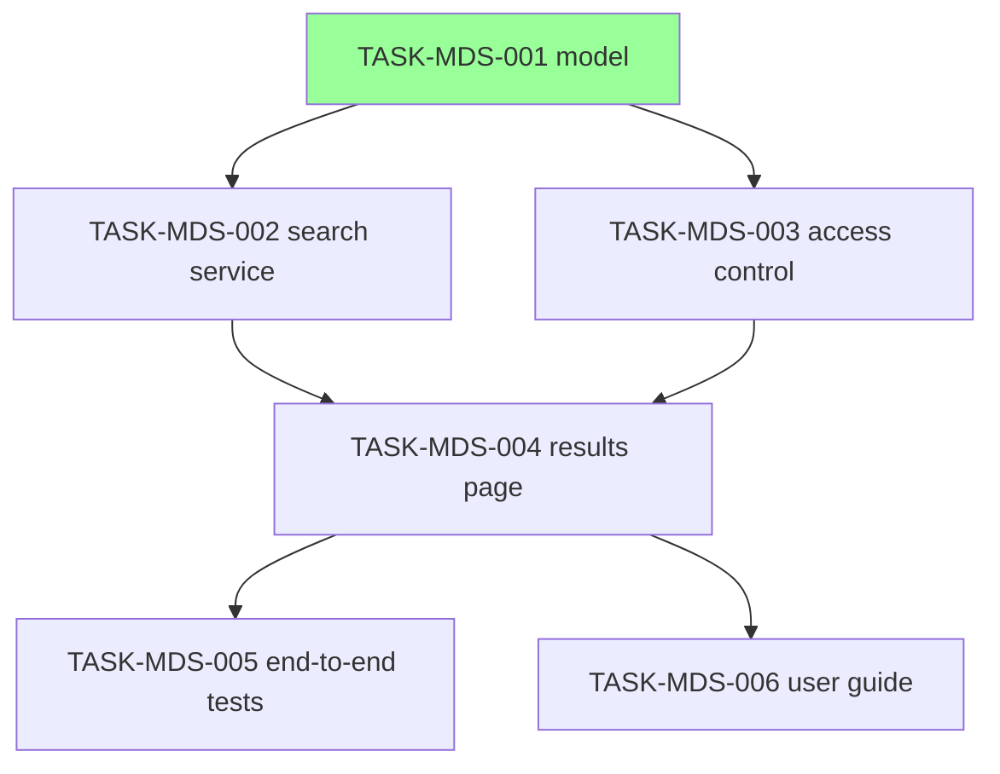

# Implementation Guide — Member Directory Search (FEAT-MDS-01)

## Architecture notes

One search service owns every query rule (paging, minimum length, opt-out
exclusion); access control wraps it; the results page renders its outcomes.
The three assumed values from the spec (page size 20, minimum query length
2, opt-out flag) each live in one named constant so the deferred-assumption
approval loop can retarget them in one place.

## Data Flow: Read/Write Paths

Every write path (seed, opt-out flag) is read by the search service; no
disconnected reads or writes — no Disconnection Alert.

## Task Dependencies

TASK-MDS-002 and TASK-MDS-003 are parallel-safe (wave 2): both depend only
on the wave-1 model.

## Wave plan

1. **Wave 1** — TASK-MDS-001 (model + seed fixture)
2. **Wave 2** — TASK-MDS-002 ∥ TASK-MDS-003
3. **Wave 3** — TASK-MDS-004 (integrates both wave-2 tasks)
4. **Wave 4** — TASK-MDS-005 ∥ TASK-MDS-006 (tests and guide over the assembled feature)
