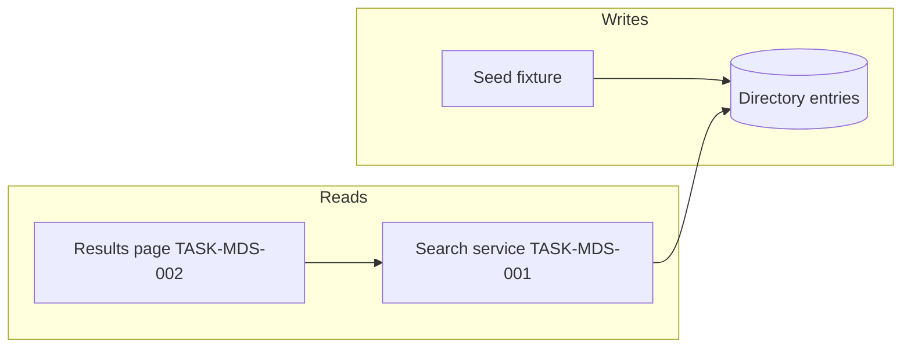
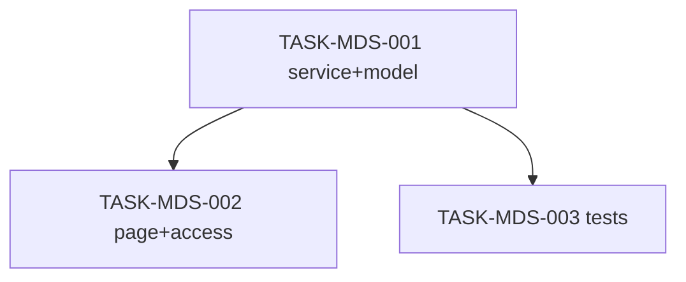

# Implementation Guide — Member Directory Search (FEAT-MDS-01)

## Data Flow: Read/Write Paths

```mermaid
flowchart LR
    subgraph Writes
        SEED[Seed fixture] --> MODEL[(Directory entries)]
    end
    subgraph Reads
        SVC[Search service TASK-MDS-001] --> MODEL
        PAGE[Results page TASK-MDS-002] --> SVC
    end
```

## Task Dependencies

```mermaid
graph TD
    T1[TASK-MDS-001 service+model] --> T2[TASK-MDS-002 page+access]
    T1 --> T3[TASK-MDS-003 tests]
```
